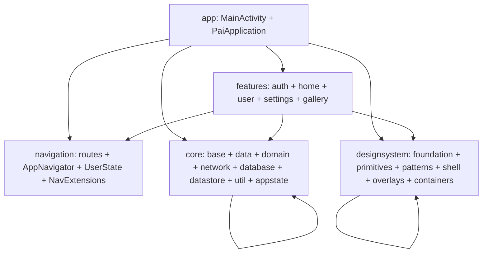

# Pai Scaffold

> 通用 Android 脚手架 · AI-first · 单模块 · Jetpack Compose  
> 一套脚手架，clone 即用，开发多个不同种类的应用

> ⚠️ **Bleeding-Edge 2026 版本警告**：本脚手架使用前沿版本（AGP 9.x / Kotlin 2.3.x / Compose BOM 2026.05）。若 Maven Central 尚未发布这些版本，构建会因依赖解析失败而中断。回退稳定版见 `gradle/libs.versions.toml` 顶部注释。

---

## 阅读路径

```
项目说明 → 集成 → 构建 → 编码规范 → 组件 API → 容器使用 → 静态检查
README    INTEG   BUILD   CODING     API         CONTAINER   QUALITY
 (本文件)
```

| 顺序 | 文档 | 阶段 | 内容 |
|---|---|---|---|
| 1 | **README.md**（本文件） | 项目说明 | 是什么 / 技术栈 / 架构概览 |
| 2 | [INTEGRATION_GUIDE.md](INTEGRATION_GUIDE.md) | 集成 | 业务怎么接入（clone → 第一个页面） |
| 3 | [BUILD.md](BUILD.md) | 构建 | 环境配置 / 构建命令 / Termux |
| 4 | [CODING.md](CODING.md) | 编码规范 | 命名 / 包隔离 / 路由 / ViewModel |
| 5 | [docs/components/README.md](docs/components/README.md) | 组件 API | 速查表 + 决策树 |
| 6 | [docs/components/containers.md](docs/components/containers.md) | 容器使用 | AppCommonCard / AppStructuredCard |
| 7 | [QUALITY.md](QUALITY.md) | 静态检查 | KtLint / Detekt / 测试 / CI / 生产就绪 |

---

## 这是什么

Pai Scaffold 是一套 **AI-first** 的 Android 脚手架：

- **clone 即用**：`./scripts/create-app.sh` 一行改包名，立即可开发
- **AI 协作**：Claude Code / OpenCode 直接读 `CLAUDE.md` / `AGENTS.md`，按 `docs/rules/` 规则生成代码
- **单模块**：不拆模块，用 `internal` 可见性 + Konsist 架构测试保证隔离
- **M3 卓越线**：完整 Material Design 3 组件库，含动态配色 / 高对比度 / 共享元素转场 / 响应式布局
- **生产就绪**：Hilt + Room + Retrofit + EncryptedPrefs + TokenAuthenticator + CI 8 Job

适合 **1 人 + AI** 团队快速开发多个不同种类的 App。

---

## 技术栈

```
AGP 9.2.1 / Kotlin 2.3.21 / KSP 2.3.9 / Gradle 9.5.1
Compose BOM 2026.05.00 / Material 3 (由 BOM 管理)
Hilt 2.59.2 / Room 2.8.4 / Retrofit 2.12.0 / OkHttp 5.4.0
DataStore 1.2.1 / Coil 2.7.0 / Lottie 6.7.1 / Chucker 4.3.1
androidx.security:security-crypto 1.1.0-alpha06 / Kover 0.9.1
compileSdk 36 / minSdk 24 / JVM 17
```

支持在 Android Termux 环境构建（可选），见 [BUILD.md](BUILD.md) Termux 章节。

---

## 架构概览



**架构红线**（由 Konsist 架构测试 + 自动生成图共同守护）：
- `feature/*` 之间不得互相 import（隔离）
- `feature/*` 不得直接 import `retrofit2.*` / `androidx.room.*`（必须经 `core/data` 或 `core/domain`）
- `core/domain` 不得 import `android.*` / `retrofit2.*` / `androidx.room.*`（KMP-ready 纯 Kotlin）
- `core/designsystem/<层>` 之间单向依赖：`foundation ← primitives ← patterns`、`foundation ← shell`、`foundation + primitives ← overlays`

完整自动生成依赖图见 [docs/architecture-graph.md](docs/architecture-graph.md)（`scripts/arch-graph.sh` 生成，CI 验证）。

---

## 脚手架包含什么

| 维度 | 内容 |
|---|---|
| **DS 组件** | 83 个 .kt 文件（primitives 30 + patterns 7 + shell 7 + overlays 12 + containers 2 + foundation 25） |
| **动效系统** | DSMotionScheme 统一动效入口 + 共享元素转场 + pressScale + Lottie |
| **主题系统** | 4 档主题模式（Light/Dark/AMOLED/HighContrast）+ 5 套品牌色板 + 4 档字号缩放 + Dynamic Color |
| **页面骨架** | DSAppScaffold（封装 M3 Scaffold + DSTopBar + SnackbarHost） |
| **业务容器壳** | AppCommonCard（slot 驱动）+ AppStructuredCard（数据驱动） |
| **导航** | 类型安全路由 + AppNavigator + RouteInterceptor + savedStateHandle 结果回传 |
| **基类** | BaseViewModel + BaseNetWorkViewModel + Flow.asResult + ResultHandler |
| **状态机** | DSUiState sealed interface（8 种状态）+ DSPageStateLayout + UserState（登录态单一真相源） |
| **网络** | Retrofit + OkHttp + Chucker + HeaderInterceptor + TokenAuthenticator（401 → 全局登出） |
| **Token 安全** | EncryptedSharedPreferences（AES256-GCM）+ redactHeader("Authorization") + allowBackup=false |
| **持久化** | Room（exportSchema=true）+ DataStore + EncryptedPrefs |
| **页面模板** | A 详情页 / B 纯状态页 / C 表单页 / D 列表分页页 / E 设置页 / F 主从页 |
| **AI 规则** | 15 个 docs/rules/ 文件 + 文档自维护协议 |
| **测试** | 单元测试 + Hilt UI 测试 + MockK + Turbine + Robolectric + MockWebServer + Konsist + Paparazzi 截图测试 |
| **CI** | GitHub Actions 8 Job + pre-commit hook + KtLint + Detekt + Kover |
| **示例 Feature** | auth / home / user / settings / gallery（含 9 个子页路由） |

---

## 脚本

| 脚本 | 用途 |
|---|---|
| `scripts/create-app.sh <包名> [应用名]` | clone 后原地改包名 |
| `scripts/backport.sh <脚手架路径> <文件...>` | 把 App 中的通用能力回传脚手架 |
| `scripts/arch-graph.sh [--check]` | 扫描 import 生成 Mermaid 架构依赖图 |
| `scripts/sync-tokens.sh [--check]` | Figma Tokens Studio → Style Dictionary → ColorTokens.kt 同步 |
| `scripts/check-production.sh` | 生产就绪自动检查 |
| `scripts/pre-commit` | Git 提交前自动检查（KtLint + 测试） |

---

## 其他文档

| 文档 | 用途 |
|---|---|
| [CLAUDE.md](CLAUDE.md) | Claude Code 主索引（工具自动加载） |
| [AGENTS.md](AGENTS.md) | OpenCode 主索引 |
| [CHANGELOG.md](CHANGELOG.md) | 变更日志 |
| [ROADMAP.md](ROADMAP.md) | 演进路线图 |
| [docs/INDEX.md](docs/INDEX.md) | 完整文档导航 |

---

## License

MIT License © 2026 Pai Scaffold
