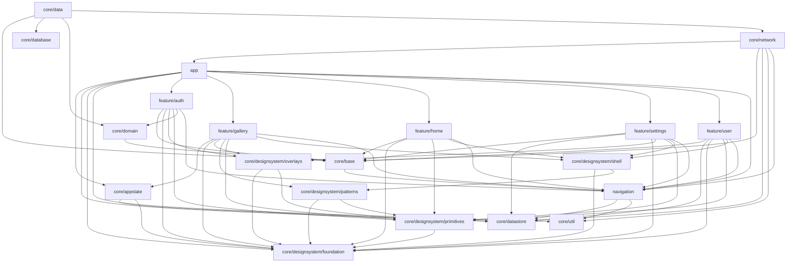

<!-- AUTO-GENERATED by scripts/arch-graph.sh — DO NOT EDIT -->
<!-- Run ./scripts/arch-graph.sh to regenerate -->

# Architecture Graph

> 本图由 `scripts/arch-graph.sh` 扫描 `app/src/main/java/com/pai/app/**/*.kt` 的 import 自动生成。
> 修改代码后运行 `./scripts/arch-graph.sh` 更新。CI 会验证图是否最新。

## 依赖图

## 统计

- 节点数: 20
- 边数: 63
- 生成时间: 2026-06-21 23:59:31 UTC
